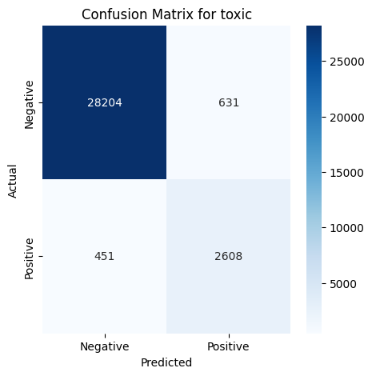
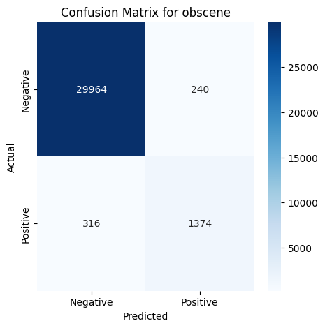
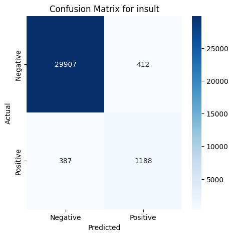

# Toxic Comment Classification Using BERT


## Table of Contents

- [Project Overview](#project-overview)
- [Features](#features)
- [Technologies Used](#technologies-used)
- [Dataset](#dataset)
- [Installation](#installation)
- [Usage](#usage)
- [Methodology](#methodology)
  - [Data Preprocessing](#data-preprocessing)
  - [Model Architecture](#model-architecture)
  - [Training Procedure](#training-procedure)
  - [Evaluation Metrics](#evaluation-metrics)
- [Results](#results)
- [Future Work](#future-work)
- [Acknowledgments](#acknowledgments)
- [Contact](#contact)

---

## Project Overview

This project focuses on building a **multi-label classification system** for identifying various forms of toxicity in online comments. Using **BERT** (Bidirectional Encoder Representations from Transformers), the system classifies comments into six categories:
- **Toxic**
- **Severe Toxic**
- **Obscene**
- **Threat**
- **Insult**
- **Identity Hate**

The project addresses challenges such as class imbalance and real-world deployment by leveraging modern NLP techniques and handling imbalanced datasets effectively.

---

## Features

- **BERT-based Architecture:** Utilizes Hugging Face's `bert-base-uncased` for robust text understanding.
- **Multi-Label Classification:** Simultaneously detects multiple toxic behaviors in a single comment.
- **Imbalanced Data Handling:** Implements class weighting and custom loss functions for better performance on underrepresented classes.

---

## Technologies Used

- **Programming Language:** Python 3.8+
- **Libraries:**
  - **Machine Learning:** PyTorch, Hugging Face Transformers
  - **Data Processing:** Pandas, NumPy, NLTK
  - **Visualization:** Matplotlib, Seaborn
- **Version Control:** GitHub

---

## Dataset

The dataset consists of user-generated comments labeled with one or more toxicity categories. It includes:
- **Features:**
  - `comment_text`: The actual comment.
- **Labels:** Toxicity indicators (`toxic`, `severe_toxic`, etc.).

### Dataset Source
- Placeholder for dataset source (e.g., Kaggle Toxic Comment Classification Challenge).

---

## Installation

### Prerequisites
- Python 3.8+
- pip

### Steps to Install

1. **Clone the Repository:**
   ```bash
   git clone https://github.com/yourusername/toxic-comment-classification.git
   cd toxic-comment-classification
   ```
2. **Set Up a Virtual Environment:**
   ```bash
   python -m venv venv
   source venv/bin/activate  # On Windows: venv\Scripts\activate
   ```
3. **Install Dependencies:**
   ```bash
   pip install -r requirements.txt
   ```
   
---

## Usage

### Run Data Preprocessing
- Use toxic-language-dataset.ipynb to clean and preprocess the dataset.

### Evaluate the Model
- Use the evaluation notebook or scripts to assess the model's performance on validation data.

---

## Methodology

### Data preprocessing
- Cleaned text data using techniques like stopword removal, punctuation handling, and normalization.
- Tokenized text using BERT's tokenizer to create input IDs and attention masks.

### Model Architecture
- **Base Model:** bert-base-uncased from Hugging Face's Transformers library.
- **Classification Head:** A fully connected layer outputs six labels for multi-label classification.

### Training Procedure
- Used Binary Cross-Entropy with Logits Loss as the loss function, modified to include class weights.
- Enhanced training with:
    - Gradient Clipping
    - Dynamic learning rate scheduling
    - Mixed precision training (fp16)

### Evaluation Metrics:
- **F1-Score:** Assesses the balance between precision and recall for each label.
- **Precision/Recall:** Measures performance on minority classes.
- **Confusion Matrix:** Evaluates classification performance on individual labels.

---

## Results
| Model          | Precision | Recall | F1-Score |
|----------------|-----------|--------|----------|
| Toxic          | 0.81      | 0.85   | 0.83     |
| Severe Toxic   | 0.50      | 0.49   | 0.49     |
| Obscene        | 0.85      | 0.81   | 0.83     |
| Threat         | 0.61      | 0.57   | 0.59     |
| Insult         | 0.74      | 0.75   | 0.75     |
| Identity Hate  | 0.54      | 0.54   | 0.54     |







---

## Future Work
- Experiment with alternative architecture such as RoBERTa or DistilBERT
- Explore advanced techniques for imbalanced classes
- Integrate the model with an API or add it to an extension for real-time inference

---

## Acknowledgements

- **Hugging Face:** For providing pre-trained models and tools.
- **Pytorch:** For maching learning framework
- **Kaggle:** [Toxic Comment Classification dataset](https://www.kaggle.com/competitions/jigsaw-toxic-comment-classification-challenge/data)
